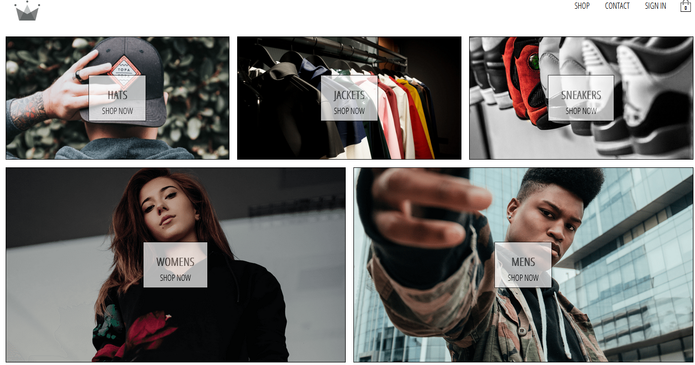
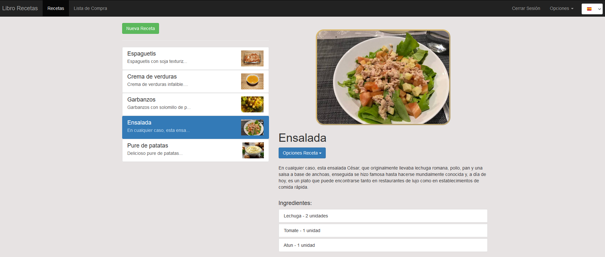
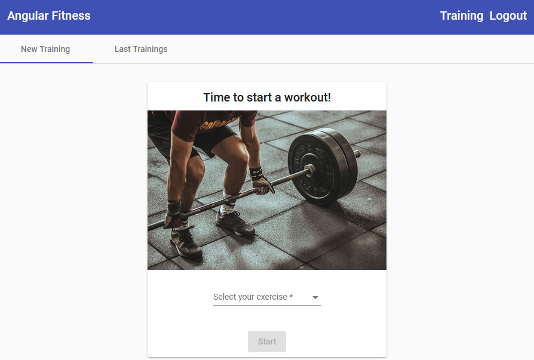
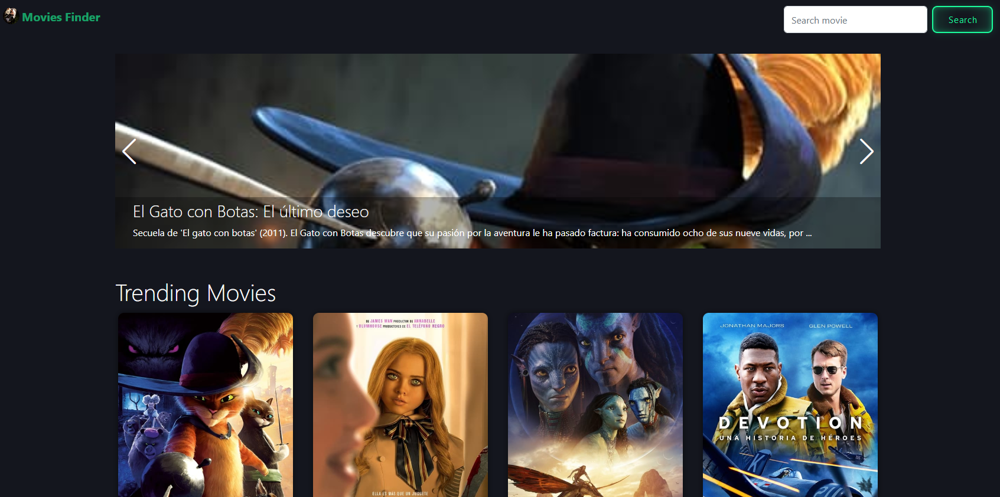

This is a list of my personal projects hosted:

- **Ecommerce clothes app**: Clothing store website in React with Redux, Hooks, GraphQL, ContextAPI, Stripe, Firebase...

> 

>  

- **Recipe list app**: Recipe List App in Angular using NgRx(Redux), Firebase...

> 

- **Training tracker app**: Application to track your trainings using Angular Material, AngularFire and NgRx(Redux)

>  

- **Clone Amazon React app**: Application to clone the Amazon web app using React, Firebase and Stripe

>  
